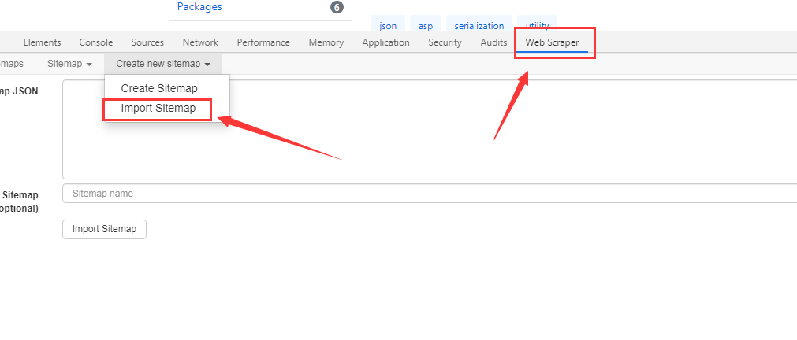
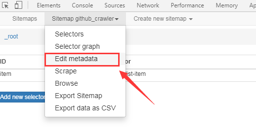
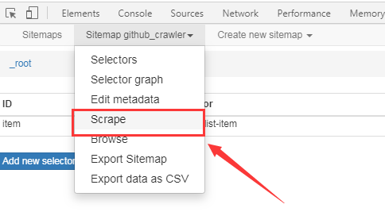
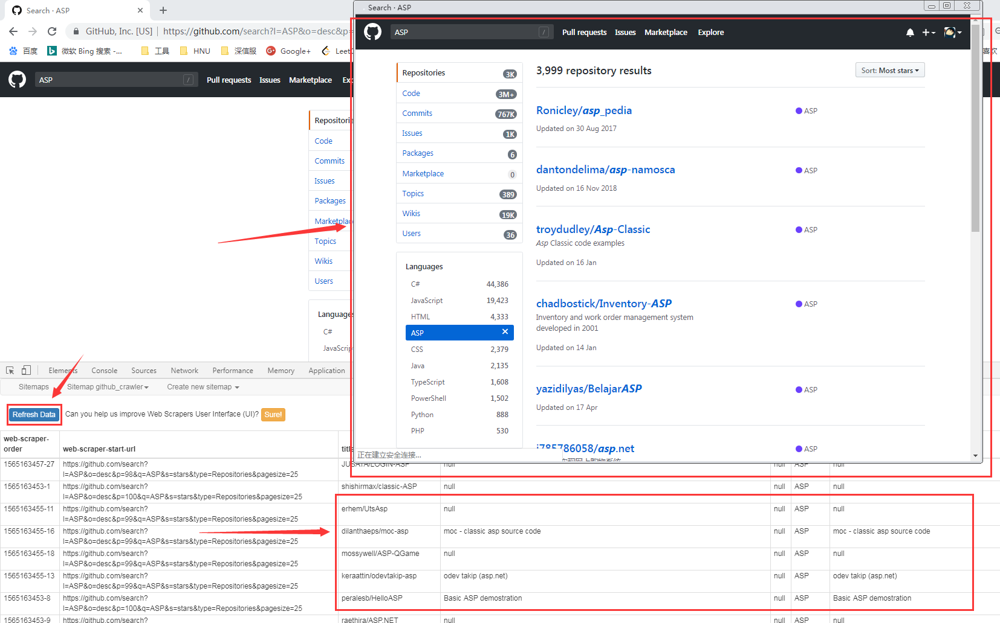
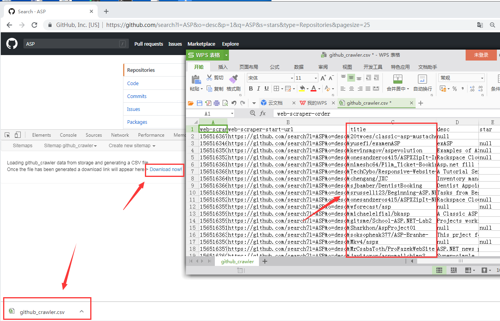

# github 爬虫介绍

## 1. 批量爬取github代码一共分两步:
+ a. 批量爬取项目名 -  ([webscraper](https://www.webscraper.io/))
+ b. 批量clone代码 - (Python os.system)


## 2. 目标网站分析
Github的网站结构非常简单，也没有啥反爬虫的策略，我们在主页搜索Python就会进入Python相关的主题页面


目标url:
`
https://github.com/search?l=ASP&o=desc&p=1&q=Asp&s=stars&type=Repositories&pagesize=25
`

参数说明:
|参数|说明|
|-|-|
|p|页号|
|q|语言|
|type|表示查的Repo|
|pagesize|单页展示个数|
|s|排序条件|

然后看一下页面最底端有100页.

导入配置文件:


## 3. webscraper使用

chrome 浏览器打开目标页面  
  a. 按F12 选择Web Scraper
  b. Create new sitemap 

有两种方法:
### 3.1 方法一(`Hard`):创建`websitemap`
`Create new sitemap ->Create Sitemap`


自己定义爬取规则,相关操作参考这篇文章:[<<我不写一行代码，爬取GitHub上几万代码>>](http://5b0988e595225.cdn.sohucs.com/images/20180118/f3c008145da04591b3c535f5f685b0b2.jpeg)

> 建议使用方法二

----

### 3.2 方法二(`Easy`): 
#### 3.2.1 导入`websitemap`

`Create new sitemap ->Import Sitemap`



> 这是我配置好的信息

```
{"_id":"github","startUrl":["https://github.com/search?l=PHP&o=desc&p=[1-100:1]&q=Php&s=stars&type=Repositories&pagesize=25"],"selectors":[{"id":"item","type":"SelectorElement","parentSelectors":["_root"],"selector":"li.repo-list-item","multiple":true,"delay":0},{"id":"title","type":"SelectorText","parentSelectors":["item"],"selector":"a.v-align-middle","multiple":false,"regex":"","delay":0},{"id":"desc","type":"SelectorText","parentSelectors":["item"],"selector":"p.col-12","multiple":false,"regex":"","delay":0},{"id":"star","type":"SelectorText","parentSelectors":["item"],"selector":".pl-2 a","multiple":false,"regex":"","delay":0},{"id":"language","type":"SelectorText","parentSelectors":["item"],"selector":"span[itemprop='programmingLanguage']","multiple":false,"regex":"","delay":0},{"id":"update","type":"SelectorText","parentSelectors":["item"],"selector":"p.col-12","multiple":false,"regex":"","delay":0}]}
```

#### 3.2.2 修改URL



修改成我们的目标url:

`
https://github.com/search?l=ASP&o=desc&p=[1-100:1]&q=ASP&s=stars&type=Repositories&pagesize=25
`
***p=[1-100:1] 表示1~100页,遍历每一页***


#### 3.2.3 开始爬取




#### 3.2.4 实时展示




####  3.2.5 数据下载



## 4. 批量代码下载
现在我们已经将要下载的项目名信息全都拿下来了,离拿到数据就差最后一步,组拼`url`,批量`clone`.

```
# -*- coding:utf-8 -*-
# Created by LuoJie at 2019/7/23 10:41
import os

import pandas as pd
from tqdm import tqdm


def batch_clone(urls, save_dir):
    """
    :param urls: [url1 ,url2]
    """
    for url in tqdm(urls): clone_project(url, save_dir)


def load_data(data_path, star_thresh):
    df = pd.read_csv(data_path)
    df = preprocessed(df)
    df = df[df['star'] > star_thresh]
    print('project count={}'.format(len(df)))
    return df


def transform_star_unit(x):
    return int(x) if 'k' in x else int(float(x.replace('k', '')) * 1000)


def preprocessed(data_df):
    data_df['star'] = data_df['star'].apply(lambda x: transform_star_unit(x))
    data_df['title'] = data_df['title'].apply(lambda x: get_url(x))
    return data_df


def clone_project(url, save_dir):
    domain, path = url.split(':')[1].split('/')
    path = path.split('.')[0]
    os.system('git clone {} {}{}_{}'.format(url, save_dir, domain, path))


def get_url(title):
    domain, path = title.split('/')
    url = 'git@github.com:{}/{}.git'.format(domain, path)
    return url


if __name__ == '__main__':
    star_thresh = 1000
    git_data_path = 'data/github.csv'
    save_dir = '/dataset/'
    data = load_data(git_data_path, star_thresh)
    urls = data['title'].tolist()
    batch_clone(urls, save_dir)

```